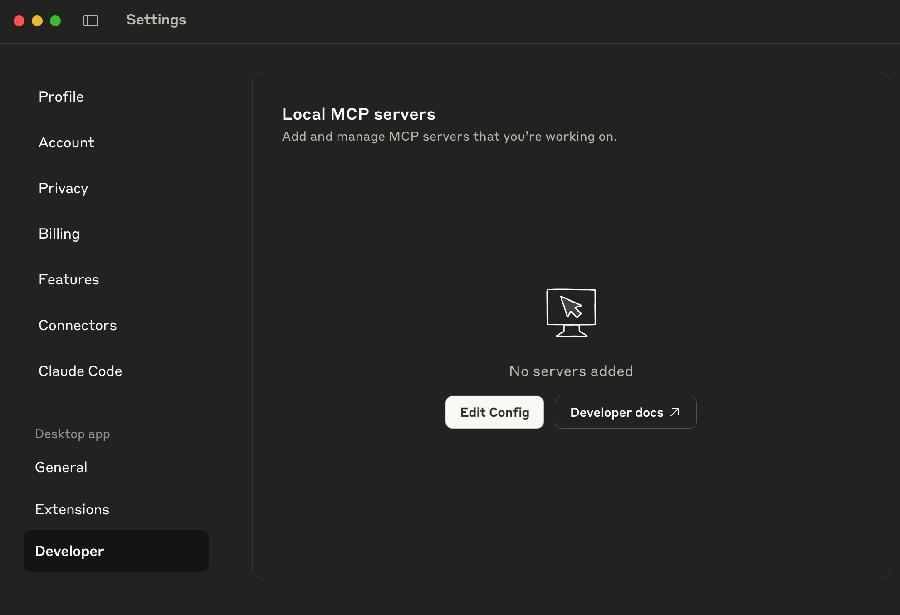
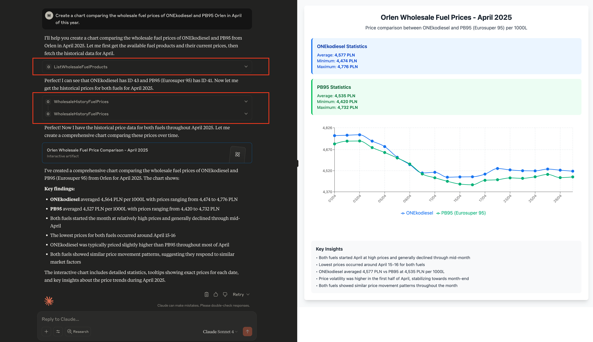

# MCP Orlen Wholesale Price - Learning Project
Model Context Protocol Servers for Orlen Wholesale Price.

## Install

Tested with Claude for MacOS.

1. You need to install [Java 24](https://www.oracle.com/java/technologies/downloads/?er=221886) first.
2. Download JAR files from [releases](https://github.com/drnow4u/mcp-orlen/releases).
3. Open Developer Settings in Claude  and hit the `Edit Config` button.
4. Edit file `claude_desktop_config.json`:
   * macOS: `~/Library/Application Support/Claude/claude_desktop_config.json`
   * Windows: `%APPDATA%\Claude\claude_desktop_config.json`
5. Add MPC Orlen Server:
   ```json
   {
     "mcpServers": {
       "orlenWholesalePriceJar": {
         "command": ">>path to your java installation<</Contents/Home/bin/java",
         "args": [
           "-jar",
           ">>path to your jar file<</mcp-orlen-0.1.0.jar"
         ]
       }
     }
   }
   ```
6. Restart Claude.
7. Example prompt:
   * EN: `Create a chart of the Orlen wholesale price of the fuel in the last month of this year`
   * PL: `Proszę narysuj wykres jak kształtowały się ceny hurtowe paliwa Orlen w ciągu ostatniego miesiąca tego roku`
8. Model response: 
9. Enjoy!
